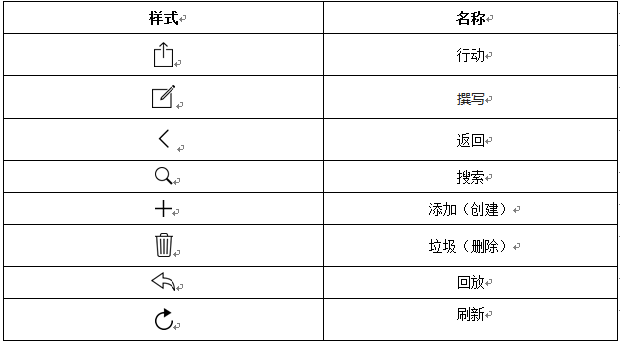
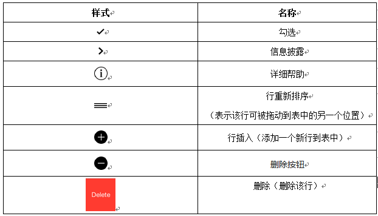
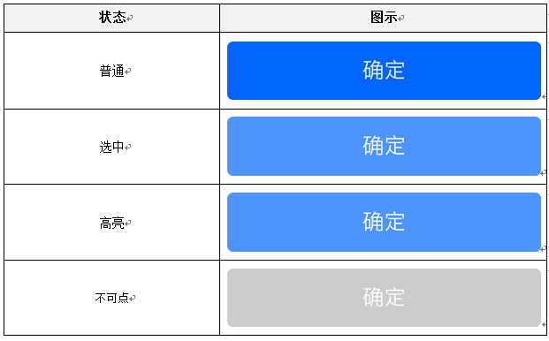
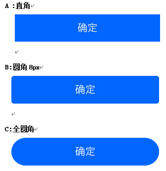
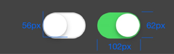
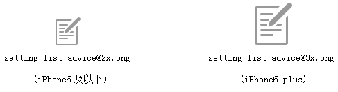
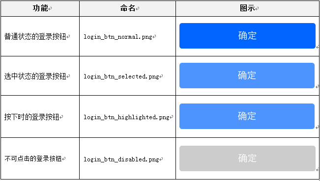

title: 按钮
---

### 图标按钮

iOS提供了许多与在内置的应用程序所使用的标准工具栏和导航栏按钮。

所以，设计过程中请尽量不要“创造”图标按钮，而多使用iOS提供的标准图标按钮或在其基础上进行“适当”修改。

工具栏和导航栏按钮举例：

iOS的包括一些表视图元素，可以扩展表视图功能。除非另有说明，这些元素都适合，只有表视图中使用。

各种"栏"的按钮icon:

各种"栏"中的按钮icon应该有两种状态：默认状态下的1或者1.5pt笔画宽度的轮廓样式，以及纯色填充的活跃状态。

不要在按钮icon上添加任何额外的效果，比如下拉阴影或者内阴影。按钮icon应该在一个透明背景上以一种纯色进行绘制--icon的形状作为遮罩，颜色将会以编程形式应用。

给每个互动的元素充足的空间，从而让用户容易操作这些内容和控件。

控件最小可点击区域为：88x88 px（这个是针对开发人员）。

### 按钮状态说明

按钮状态在设计时主要分为普通（normal）、选中（selected）、高亮（highlighted）、不可点（disabled）四种，大部分按钮都包含了这4种状态。

### 按钮样式要求

按钮三种样式：第一种是直角；第二种是圆角（圆角为8px）；第三种是全圆角。

### 设置按钮

开启、关闭样式，建议以下样式

用户可使用开关在"on"和"off"两种状态间切换。设计师可自定义两种状态的颜色，但是开关按钮的外观和尺寸是设定好的不能更改。

### 文件切片命名规则

设计的时候，我们以iPhone 6（750px/375pt）的尺寸作为基准设计，切图的时候我们通常需要切两套图。

1）格式：普通：image.png；两倍图:image@2x.png；三倍图：image@3x.png。

2）保存：png-24,保留透明度。

3）尺寸：像素（避免出现小数，如@2x的图标为88x88，@3x的图标为132x132）；

4）命名：iPhone6及以下：模块_功能_控件_状态@2x.png

iPhone6plus:模块_功能_控件_状态@3x.png

需要用英文表示。

举个例子：

文件命名实例与对应图示：

