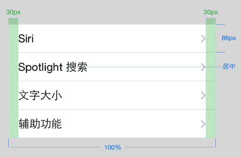
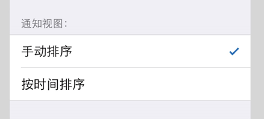
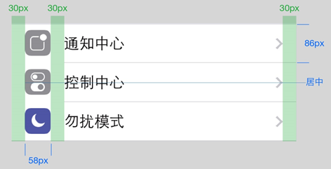
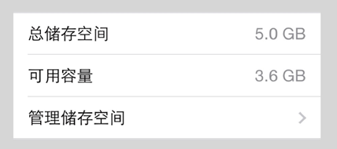

title: 表视图（Table view）
---

表视图以单列或者多列形式展示少数或者多个列表风格的信息，并有能将内容分组的选项。根据你展示的数据类型，通常可使用两种基本的表视图风格：

### 无格式的

### 分组样式

分组表视图允许用户对内容进行分组。每个分组可以有页眉（最佳用法是描述类组的上下文环境）和页脚（适用于帮助文本等）。一个分组的表视图至少需要包含一个类组，并且每个类组至少要包含一行内容。

对于以上两种表视图类型，可用几种风格来展示数据，以方便用户快速扫描、阅读和适当调整内容。

### 默认

默认的表视图有一个居左对齐的可选图片和标题。

### 带有副标题

在每行标题下展示小字号的副标题，适用于进一步的解释说明或者简短描述。

### 带有数值

带数值表类型可展示与行标题相关的特定数值。类似默认的类型，每行都有一个居左对齐的图片和标题。在该类型中，数值居右对齐，通常使用比标题淡一点的文本颜色。